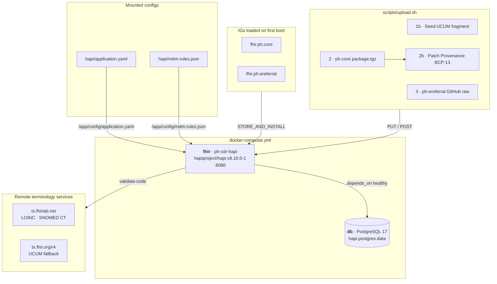

# ph-cdr — Philippine FHIR Clinical Data Repository

A HAPI FHIR v8.10.0 Docker stack for the Philippine healthcare ecosystem. Validates FHIR R4 resources against Philippine Implementation Guides, runs MDM-based patient deduplication, and seeds the server with example resources from the ph-core and ph-ereferral IGs.

## Quick Start

```bash
# 1. Clone and copy environment file
git clone https://github.com/jgsuess/ph-cdr.git
cd ph-cdr
cp .env.example .env
# edit .env to pin specific IG versions if needed

# 2. Start the stack
docker compose up -d

# 3. Wait for HAPI to finish loading IGs (~2 min on first boot)
docker compose logs -f fhir

# 4. Seed terminology and upload example resources
bash scripts/upload.sh

# 5. Browse
open http://localhost:8080/fhir/metadata
```

**Clean restart** (wipes DB — required after upgrading HAPI major version):
```bash
docker compose down -v && docker compose up -d
```

## Architecture



## Philippine Implementation Guides

| IG | Package | Default Version | Source |
|---|---|---|---|
| Philippine Core | `fhir.ph.core` | `0.1.1` | [jgsuess/ph-core](https://github.com/jgsuess/ph-core) |
| Philippine eReferral | `fhir.ph.ereferral` | `0.3.1` | [jgsuess/ph-ereferral](https://github.com/jgsuess/ph-ereferral) |

Version overrides via environment variables:
```bash
PH_CORE_VERSION=0.1.2 PH_EREFERRAL_VERSION=0.4.0 docker compose up -d
```

## Upload Results

After running `scripts/upload.sh`, a timestamped report directory is created:

```
fhir-upload-results-YYYYMMDD-HHMMSS/
├── upload-report.md        # Markdown table of all resources
├── upload-report.html      # Styled HTML version
├── summary.json            # Machine-readable pass/fail counts
├── logs/                   # Raw HAPI JSON responses per resource
└── payloads/
    ├── ph-core/            # Extracted package examples
    └── ph-ereferral/       # Downloaded GitHub examples
```

With HAPI v8.10.0 + UCUM fragment seeded + remote terminology services reachable:

| IG package | Pass | Total |
|---|---|---|
| ph-core 0.1.1 | 43 | 43 |
| ph-ereferral 0.3.1 | 22 | 22 |

## Documentation

- [Configuration Reference](docs/configuration.md) — every setting in `hapi/application.yaml`, `docker-compose.yml`, `hapi/mdm-rules.json`, and `hapi/ucum-fragment.json`
- [Known Issues & Workarounds](docs/known-issues.md) — UCUM regression, DNS on Ubuntu, draft-status profiles, transaction bundle storage
- [Adding IGs](docs/adding-igs.md) — how to register a new Philippine IG in this stack

## Requirements

- Docker Engine 24+ with Compose v2
- `curl`, `python3` (for `scripts/upload.sh`)
- ~2 GB disk (PostgreSQL data + IG packages)
- ~2–4 min first-boot time for IG loading
- Outbound internet access for terminology services and IG package download

## License

Apache 2.0
